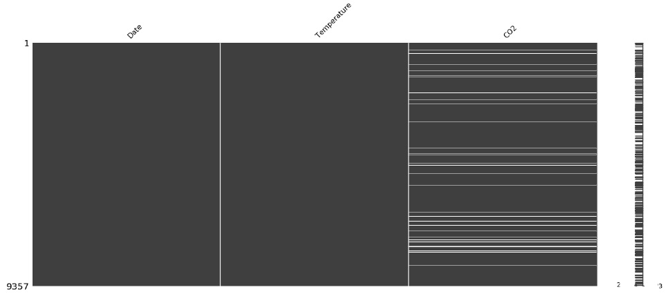

# Problemas comuns em dados
 
### Restrições de tipos de dados

É importante realizarmos um tratamento dos dados a fim de excluirmos eventuais erros que possam influenciar na análise de dados de forma indesejada (_garbage in garbage out_). 

Inicialmente devemos checar se os data types das variáveis estão corretos.

**string para inteiros**
```python
# importando arquivo CSV e imprimindo header
sales = pd.read_csv('sales.csv')
sales.head(2)

    SalesOrderID Revenue Quantity
0      43659      23153$    12
1      43660      1457$      2

# retornando data types das colunas
sales.dtypes

SalesOrderID    int64
Revenue         object
Quantity        int64
dtype: object
# os valores contidos na coluna Revenue são do tipo object, que é o tipo utilizado pelo Pandas para armazenar strings

# podemos checar o data type o e número de campos vazios por coluna em um dataframe

# retornando informação do DataFrame
sales.info()

<class 'pandas.core.frame.DataFrame'>
RangeIndex: 31465 entries, 0 to 31464
Data columns (total 3 columns):
SalesOrderID        31465 non-null int64
Revenue             31465 non-null object
Quantity            31465 non-null int64
dtypes: int64(2), object(1)
memory usage: 737.5+ KB
```
Para efetuar operações com os valores da coluna _Revenue_ , como soma, da forma que está  o resultado seria :
```python
# imprimindo a soma da coluna Revenue
sales['Revenue'].sum()

'23153$1457$36865$32474$472$27510$16158$5694$6876$40487$807$6893$9153$6895$4216..
```
Devemos então tratar os dados desta coluna :
```python
# removendo $ da coluna Revenue
sales['Revenue'] = sales['Revenue'].str.strip('$')
sales['Revenue'] = sales['Revenue'].astype('int')

# verificando se a coluna Revenue é agora formada por inteiros 
# assert - retorna um erro se a condição não for True
assert sales['Revenue'].dtype == 'int'
```

**numérico ou categórico?**

* categórico - representa categorias com uma quantidade finita de possíveis categorias 

Uma coluna de dados contendo valores numéricos representando categorias é importada com o tipo _integer_ , o que pode induzir a erros em resumos estatísticos:  
```python
marriage_status ...
... 3 ...
... 1 ...
... 2 ...
df['marriage_status'].describe()

marriage_status
...
mean    1.4
std     0.20
min     0.00
50%     1.8 ...

```
Isso pode ser resolvido da seguinte maneira :
```python
# convertendo para categórico
df["marriage_status"] = df["marriage_status"].astype('category')
df.describe()

marriage_status
count   241
unique  4
top     1
freq    120
```

### Dados fora de intervalo

Podemos nos deparar com alguns erros de dados com valores fora de seu intervalo esperado como, por exemplo, data de assinatura de clientes feitas no futuro ou avaliações com nota 11 quando o valor máximo seria 10.

**como lidar com dados fora do intervalo?**

* deletar os dados - é a maneira mais simples, porém dependendo do tamanho do dataset, podemos perder informações importantes. É necessário um bom entendimento do dataset para realizar esta operação e ela só deve ser feita quando afeta uma pequena parte do dataset.

* substituir por valores mínimos e máximos customizados.

* tratar como dados faltantes.

* substituir por um valor customizado em função das características do negócio.

```python
import pandas as pd

# retorna os filmes com avaliação maior que 5
movies[movies['avg_rating'] > 5]

     movie_name         avg_rating
23 A Beautiful Mind         6
65 La Vita e Bella          6
77     Amelie               6

# Drop values usando filtro
movies = movies[movies['avg_rating'] <= 5]

# Drop values usando .drop()
movies.drop(movies[movies['avg_rating'] > 5].index, inplace = True)

# checando resultado com assert
assert movies['avg_rating'].max() <= 5

# convertendo avg_rating > 5 para 5
movies.loc[movies['avg_rating'] > 5, 'avg_rating'] = 5

# checando resultado com assert
assert movies['avg_rating'].max() <= 5
```

Ao trabalharmos com datas, precisamos checar o tipo se o data type da coluna é do tipo data. Caso seja um objeto, devemos converter para data para fazer as comparações necessárias e isso pode ser feito da seguinte maneira :

```python
# convertendo para data
# coluna do dataframe com data a ser convertida = função pd.to_datetime(coluna do dataframe) -> converte para um objeto pandas
# datetime
# para converter o objeto datetime para data, utilizamos .dt.date
# poderíamos converter o objeto diretamente para data, mas precisaríamos passar uma string com o formato da data e desta forma
# é mais fácil fazer a conversão
user_signups['subscription_date'] = pd.to_datetime(user_signups['subscription_date']).dt.date

today_date = dt.date.today()

# Drop values usando filtro
user_signups = user_signups[user_signups['subscription_date'] < today_date]
# Drop values usando .drop()
user_signups.drop(user_signups[user_signups['subscription_date'] > today_date].index, inplace = True)

# substituindo datas futuras por data atual
user_signups.loc[user_signups['subscription_date'] > today_date, 'subscription_date'] = today_date
# checando o resultado - importante utilizar o método .date() para que uma data seja retornada e não um timestamp
assert user_signups.subscription_date.max().date() <= today_date
```

### Valores duplicados

Identificamos dados duplicados quando temos informações repatidas ao longo de múltiplas linhas ou entre diferentes colunas no dataframe. 

**como encontrar valores duplicados**

Encontramos valores duplicados com o método <code>.duplicated()</code> passando os seguintes argumentos :
* subset - lista com os nomes das colunas a serem checadas;
* keep - se devemos manter o primeiro ('first') , o último ('last') ou todos ('False') valores duplicados;
```python
# Column names to check for duplication
column_names = ['first_name','last_name','address']
duplicates = height_weight.duplicated(subset = column_names, keep = False)
```

**como tratar dados duplicados**

O método <code>.drop_duplicates()</code> retorna uma série booleana referente às linhas duplicadas e tem os seguintes argumentos:
* subset - lista com os nomes das colunas a serem checadas;
* keep - se devemos manter o primeiro ('first') , o último ('last') ou todos ('False') valores duplicados;
* inplace - deletar as linhas duplicadas diretamente do dataframe sem criar um novo objeto (True);

```python
# elimina linhas que sejam exatamente iguais ( todos os valores em suas colunas )
height_weight.drop_duplicates(inplace = True)
```
Em alguns casos o dataframe contem linhas com valores de colunas repetidos, mas alguns com diferenças em campos numéricos. Nestas situações podemos combinas estas linhas por meio de medidas estatísticas como média, por exemplo.

```python
# agrupa pelos nomes das colunas e produz resumos estatísticos
column_names = ['first_name','last_name','address']
summaries = {'height': 'max', 'weight': 'mean'}
# .reste_index() serve para que tenhamos índice numerado na saída final
height_weight = height_weight.groupby(by = column_names).agg(summaries).reset_index()

# checa se a combinação foi feita
duplicates = height_weight.duplicated(subset = column_names, keep = False)
height_weight[duplicates].sort_values(by = 'first_name')
```

___

# Problemas em dados categóricos e tipo texto

### Erros de entrada

Podemos ter dados categóricos inconsistentes por estarem assumindo valores que não deveriam, valores diferentes dos possíveis para determinada categoria. 

```python
# Read study data and print it
study_data = pd.read_csv('study.csv') study_data

    name        birthday    blood_type 
1   Beth        2019-10-20      B- 
2   Ignatius    2020-07-08      A- 
3   Paul        2019-08-12      O+ 
4   Helen       2019-03-17      O- 
5   Jennifer    2019-12-17      Z+ 
6   Kennedy     2020-04-27      A+ 
7   Keith       2019-04-19      AB+

# Correct possible blood types
categories

    blood_type 
1   O- 
2   O+    
3   A- 
4   A+ 
5   B+ 
6   B- 
7   AB+ 
8   AB-
```
No exemplo acima podemos obervar que há um registro com um registro na coluna <code>blood_type</code> incorreto : Z+. É uma boa prática, sempre que possível, manter um registro de todos os possíveis valores de dados categóricos, pois isso facilita o tratamento destas inconsitências.

**encontrando categorias inconsistentes**

```python
inconsistent_categories = set(study_data['blood_type']).difference(categories['blood_type'])
print(inconsistent_categories)

{Z+}

# Get and print rows with inconsistent categories
inconsistent_rows = study_data['blood_type'].isin(inconsistent_categories)
study_data[inconsistent_rows]

    name        birthday    blood_type
5   Jennifer    2019-12-17  Z+
```
**filtrando categorias inconsistentes**    
```python
inconsistent_categories = set(study_data['blood_type']).difference(categories['blood_type'])
inconsistent_rows = study_data['blood_type'].isin(inconsistent_categories)
inconsistent_data = study_data[inconsistent_rows]
# Drop inconsistent categories and get consistent data only
consistent_data = study_data[~inconsistent_rows] # operador ~ -> not 

    name        birthday        blood_type
1   Beth        2019-10-20      B-
2   Ignatius    2020-07-08      A-
3   Paul        2019-08-12      O+
4   Helen       2019-03-17      O-
```
### Variações categóricas
Em alguns casos podemos observar uma grande quantidade de categorias, que podem ser colapsadas em uma apenas.

É um problema comum termos valores categóricos ligeiramente diferentes por conta de letras maiúsculas e minúsculas. Para lidarmos com isto, podemos optar entre converter todas as letras para caixa alta ou caixa baixa.
```python
# Get marriage status column
marriage_status = demographics['marriage_status']
marriage_status.value_counts()

unmarried 352
married 268
MARRIED 204
UNMARRIED 176
dtype: int64

# Get value counts on DataFrame
marriage_status.groupby('marriage_status').count()

                    household_income    gender
marriage_status
MARRIED                 204             204
UNMARRIED               176             176
married                 268             268
unmarried               352             352

# Capitalize
marriage_status['marriage_status'] = marriage_status['marriage_status'].str.upper()
marriage_status['marriage_status'].value_counts()

UNMARRIED 528
MARRIED 472

# Lowercase
marriage_status['marriage_status'] = marriage_status['marriage_status'].str.lower()
marriage_status['marriage_status'].value_counts()

unmarried 528
married 472
```
Outro problema encontrado é a presença do caracter espaço no preenchimento das categorias.

```python
# Get marriage status column
marriage_status = demographics['marriage_status']
marriage_status.value_counts()

 unmarried 352
unmarried 268
married 204
married 176
dtype: int64

# Strip all spaces
demographics = demographics['marriage_status'].str.strip()
demographics['marriage_status'].value_counts()

unmarried 528
married 472
```

**colapsando dados em categorias**
Podemos criar subgrupos de categorias a partir dos dados. Isto pode ser feitos utilizando as funções <code>qcut</code> ou <code>cut</code>.

```python
# Using qcut()
import pandas as pd
group_names = ['0-200K', '200K-500K', '500K+']
demographics['income_group'] = pd.qcut(demographics['household_income'], q = 3,labels = group_names)
# Print income_group column
demographics[['income_group', 'household_income']]

    category    household_income
0   200K-500K   189243
1   500K+       778533
```
A primeira linha não reflete corretamente a subcategoria por que não definimos o range dos dados. Isto pode ser feito com a função <code>cut</code>.

```python
# Using cut() - create category ranges and names
ranges = [0,200000,500000,np.inf]
group_names = ['0-200K', '200K-500K', '500K+']
# Create income group column
demographics['income_group'] = pd.cut(demographics['household_income'], bins=ranges,labels=group_names)
demographics[['income_group', 'household_income']]

    category    Income
0   0-200K      189243
1   500K+       778533
```
Podemos também reduzir o número de categorias :
```python
# Create mapping dictionary and replace
mapping = {'Microsoft':'DesktopOS', 'MacOS':'DesktopOS', 'Linux':'DesktopOS','IOS':'MobileOS', 'Android':'MobileOS'}
devices['operating_system'] = devices['operating_system'].replace(mapping)
devices['operating_system'].unique()

array(['DesktopOS', 'MobileOS'], dtype=object
```
### Limpando dados em texto

Os erros mais comuns envonvendo dados do tipo texto são:

* inconsistência de dados ( CPF com ou sem caracteres . e - )
* violação de tamanho fixado ( senhas com número mínimo de caracteres, por exemplo )
* erros de digitação 

```python
phones = pd.read_csv('phones.csv')
print(phones)

    Full name           Phone number
0   Noelani A. Gray     001-702-397-5143
1   Myles Z. Gomez      001-329-485-0540
2   Gil B. Silva        001-195-492-2338
3   Prescott D. Hardin +1-297-996-4904
4   Benedict G. Valdez  001-969-820-3536
5   Reece M. Andrews    4138
6   Hayfa E. Keith      001-536-175-8444
7   Hedley I. Logan     001-681-552-1823
8   Jack W. Carrillo    001-910-323-5265
9   Lionel M. Davis     001-143-119-9210

# corrigindo os problemas encontrados acima : 

# Replace "+" with "00"
phones["Phone number"] = phones["Phone number"].str.replace("+","00") 
phones

    Full name           Phone number 
0   Noelani A. Gray     001-702-397-5143 
1   Myles Z. Gomez      001-329-485-0540 
2   Gil B. Silva        001-195-492-2338 
3   Prescott D. Hardin  001-297-996-4904 
4   Benedict G. Valdez  001-969-820-3536 
5   Reece M. Andrews        4138 
6   Hayfa E. Keith      001-536-175-8444 
7   Hedley I. Logan     001-681-552-1823 
8   Jack W. Carrillo    001-910-323-5265 
9   Lionel M. Davis     001-143-119-9210

# Replace "-" with nothing
phones["Phone number"] = phones["Phone number"].str.replace("-","") 
phones

    Full name           Phone number 
0   Noelani A. Gray     0017023975143 
1   Myles Z. Gomez      0013294850540 
2   Gil B. Silva        0011954922338 
3   Prescott D. Hardin  0012979964904 
4   Benedict G. Valdez  0019698203536 
5   Reece M. Andrews        4138 
6   Hayfa E. Keith      0015361758444 
7   Hedley I. Logan     0016815521823 
8   Jack W. Carrillo    0019103235265 
9   Lionel M. Davis     0011431199210

# Replace phone numbers with lower than 10 digits to NaN
digits = phones['Phone number'].str.len()
phones.loc[digits <10,"Phone number"] = np.nan
phones

    Full name           Phone number 
0   Noelani A. Gray     0017023975143 
1   Myles Z. Gomez      0013294850540 
2   Gil B. Silva        0011954922338 
3   Prescott D. Hardin  0012979964904 
4   Benedict G. Valdez  0019698203536 
5   Reece M. Andrews        NaN 
6   Hayfa E. Keith      0015361758444 
7   Hedley I. Logan     0016815521823 
8   Jack W. Carrillo    0019103235265 
9   Lionel M. Davis     0011431199210

# Find length of each row in Phone number column
sanity_check = phone['Phone number'].str.len()
# Assert minmum phone number length is 10
assert sanity_check.min() >= 10
# Assert all numbers do not have "+" or "-"
assert phone['Phone number'].str.contains("+|-").any() == False

```
Caso nos deparemos com padrões mais complexos podemos fazer uso de _regular expressions_ , que permitem identificar padrões.

```python
phones.head()

    Full name           Phone number
0   Olga Robinson       +(01706)-25891
1   Justina Kim         +0500-571437
2   Tamekah Henson      +0800-1111
3   Miranda Solis       +07058-879063
4   Caldwell Gilliam    +(016977)-8424

# Replace letters with nothing
# o padrão no método str.replace informa ao Pandas para substituir qualquer valor diferente de dígito com vazio
phones['Phone number'] = phones['Phone number'].str.replace(r'\D+', '')
phones.head()

    Full name           Phone number
0   Olga Robinson       0170625891
1   Justina Kim         0500571437
2   Tamekah Henson      08001111
3   Miranda Solis       07058879063
4   Caldwell Gilliam    0169778424
```
___

# Problemas avançados em dados

### Uniformidade

Grandezas físicas podem ser mensuradas em diversas unidades de medida e precisamos que todos os dados estejam em uma mesma escala para evitar distorções nas análises como, por exemplo, comparar temperatura em °C e °F.

```python
temperatures = pd.read_csv('temperature.csv') 
temperatures.head()

    Date        Temperature 
0   03.03.19    14.0 
1   04.03.19    15.0 
2   05.03.19    18.0 
3   06.03.19    16.0 
4   07.03.19    62.6

# Import matplotlib
import matplotlib.pyplot as plt
# Create scatter plot
plt.scatter(x = 'Date', y = 'Temperature', data = temperatures)
# Create title, xlabel and ylabel
plt.title('Temperature in Celsius March 2019 - NYC')
plt.xlabel('Dates')
plt.ylabel('Temperature in Celsius')
# Show plot
plt.show()
```


Pelo gráfico plotado, podemos notar alguns valores de temperatura muito elevados para estarem em °C e podemos resolver este problema convertendo estes valores que, provavelmente estão em °F, para °C.

```python
# o valor arbitrado como limite o valor de temperatura 40°C
temp_fah = temperatures.loc[temperatures['Temperature'] > 40, 'Temperature']
temp_cels = (temp_fah - 32) * (5/9)
temperatures.loc[temperatures['Temperature'] > 40, 'Temperature'] = temp_cels

# Assert conversion is correct
assert temperatures['Temperature'].max() < 40

```
**tratando dados de data**
```python
birthdays.head()

    Birthday        First name  Last name
0   27/27/19        Rowan       Nunez
1   03-29-19        Brynn       Yang
2   March 3rd, 2019 Sophia      Reilly
3   24-03-19        Deacon      Prince
4   06-03-19        Griffith    Neal

```
Podemos tratar os dados acima por meio do formato <code>datetime</code>, que reconhece automaticamente a maioria dos formatos.

```python
# Attempt to infer format of each date
# Return NA for rows where conversion failed
birthdays['Birthday'] = pd.to_datetime(birthdays['Birthday'],infer_datetime_format=True,errors = 'coerce')

birthdays.head()

    Birthday    First name  Last name
0   NaT         Rowan       Nunez
1   2019-03-29  Brynn       Yang
2   2019-03-03  Sophia      Reilly
3   2019-03-24  Deacon      Prince
4   2019-06-03  Griffith    Neal

# podemos alterar o formato exibido por meio de uma string
birthdays['Birthday'] = birthdays['Birthday'].dt.strftime("%d-%m-%Y")
birthdays.head()

    Birthday    First name  Last name
0   NaT         Rowan       Nunez
1   29-03-2019  Brynn       Yang
2   03-03-2019  Sophia      Reilly
3   24-03-2019  Deacon      Prince
4   03-06-2019  Griffith    Neal

```
Algumas vezes teremos dados com data de valor ambíguo : 2019-03-08 seria março ou agosto? Neste caso podemos :
* converter para NA
* deduzir o formato conforme a fonte dos dados 
* deduzir o formato conforme outras entradas no mesmo dataframe

### Validação com campos cruzados

É comum termos dados consolidados a partir de diversas fontes e devemos checar sua integridade. Utilizar múltiplos campos para checar se os dados estão coerentes é uma forma de fazer esta verificação.


```python
# exemplo para checar se o campo idade está corretamente preenchido
import pandas as pd
import datetime as dt
# convertendo para datetime e obtendo a data de hoje
users['Birthday'] = pd.to_datetime(users['Birthday'])
today = dt.date.today()
# para cada linha na coluna Birthday, calcula a diferença de ano
age_manual = today.year - users['Birthday'].dt.year
# encontrando as intâncias em que a idade está correta
age_equ = age_manual == users['Age']
# encontrando e filtrando as linhas com idade inconsistente
inconsistent_age = users[~age_equ]
consistent_age = users[age_equ]
```

### Integridade

Dados faltantes é um dos mais comuns e importantes problemas de limpeza de dados. São normalmente representados por NA e NAN, mas podem ser arbitrariamente representados por 0 ou "." . 

```python
import pandas as pd
airquality = pd.read_csv('airquality.csv')
print(airquality)
```


```python
# Return missing values
airquality.isna()
```


```python
# Get summary of missingness
airquality.isna().sum()
```


O pacote <code>missingno</code> fornece ferramentais visuais úteis para visualização de dados faltantes ( missing data ). 

```python
import missingno as msno
import matplotlib.pyplot as plt
# Visualize missingness
msno.matrix(airquality)
plt.show()
```


A matriz acima exibe em linhas como estão distribuídos os dados faltantes no dataframe.

Embora a distribuição de _missing data_ pareça aleatória, uma análise um pouco mais a fundo mostra que na verdade há um padrão.

```python
# Isolate missing and complete values aside
missing = airquality[airquality['CO2'].isna()]
complete = airquality[~airquality['CO2'].isna()]

# Describe complete DataFramee
complete.describe()
```


```python
# Describe missing DataFramee
missing.describe()
```


Pelas informações obtidas com o método <code>describe()</code> notamos que a ausência de valores para concentração de CO2 ocorre em baixas temperaturas, o que pode ser causado por uma falha de medição a baixas temperaturas. 

Utilizando novamente os recursos do <code>missingno</code> podemos visualizar de forma mais clara:

```python
sorted_airquality = airquality.sort_values(by = 'Temperature')
msno.matrix(sorted_airquality)
plt.show()
```


**como tratar dados faltantes**
* abordagens mais simples
    * deletar dados faltantes
    * alimentar com medidas estatísticas como média, mediana, moda...

* abordagens mais complexas
    * alimentar com alguma aproximação por algoritmo
    * alimentar com dados gerados por modelos de _machine learning_

```pthon
airquality.head()
```


```python
# Drop missing values
airquality_dropped = airquality.dropna(subset = ['CO2'])
airquality_dropped.head()
```


```python
# replacing with statistical measures
# fillna takes in a dictionary with columns as keys, and the imputed value as values

co2_mean = airquality['CO2'].mean()
airquality_imputed = airquality.fillna({'CO2': co2_mean})
airquality_imputed.head()
Date Temperature
```


___


# Ligação de registro

###

###

###

